# Crux — Architecture Diagrams

All diagrams reflect the current codebase as of Phase 2 (MVP).

---

## 1. High-Level System Architecture

> What crux is and what it produces.

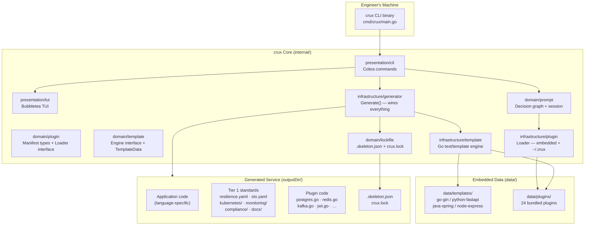

---

## 2. Hexagonal Architecture (Ports & Adapters)

> How the crux codebase itself is structured internally.

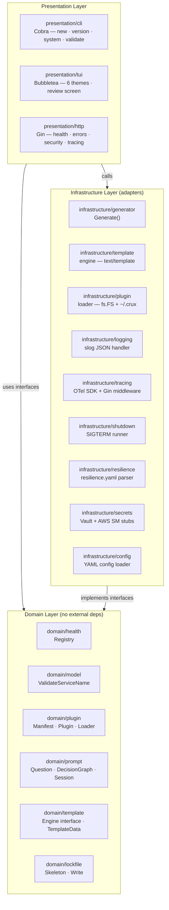

---

## 3. `crux new` — Full Sequence Diagram

> Every step from the engineer running the command to files on disk.

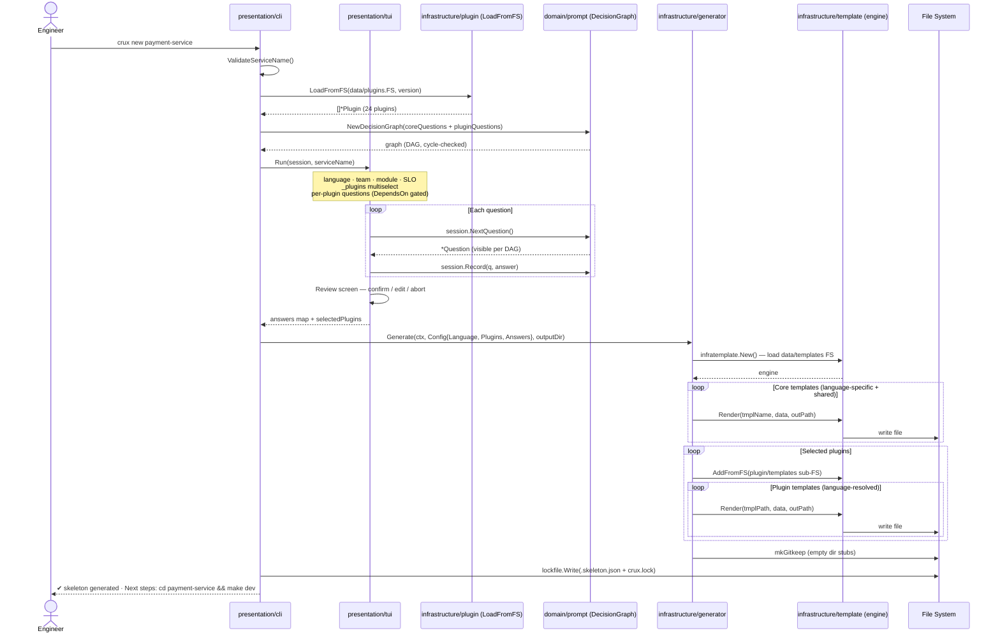

---

## 4. Plugin System — Component Diagram

> How plugins are discovered, loaded, and rendered.

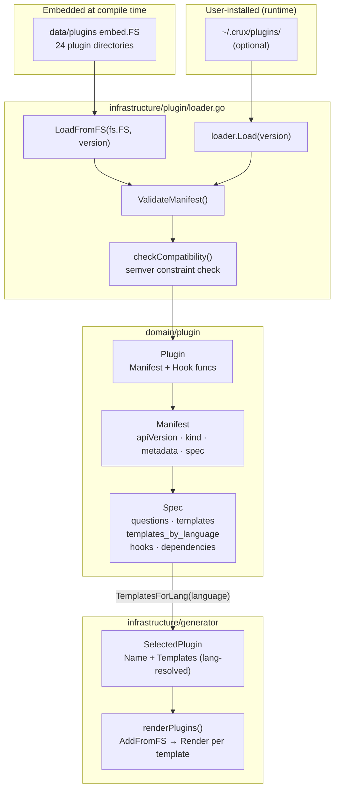

---

## 5. Plugin Trust Tiers

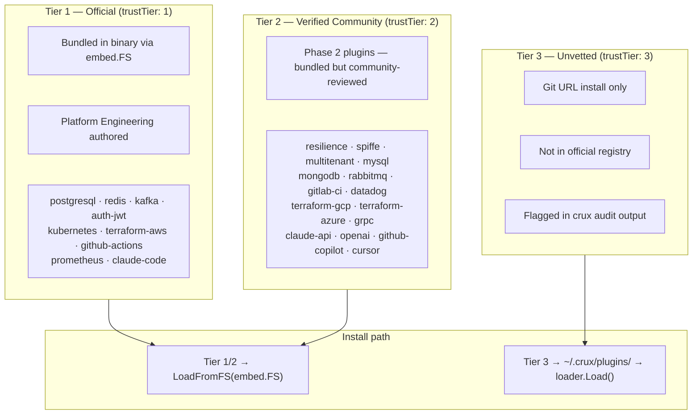

---

## 6. Decision Graph — Question Dependency Flow

> How the prompt engine resolves which questions to show.

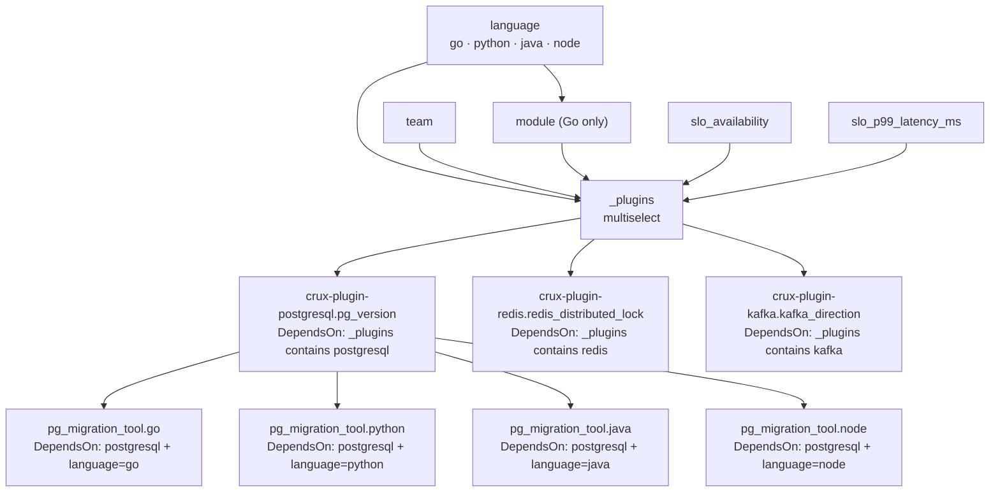

---

## 7. Template Engine — Rendering Pipeline

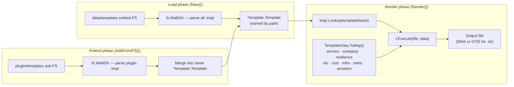

---

## 8. Language × Plugin Template Resolution

> How the generator picks the right template for the selected language.

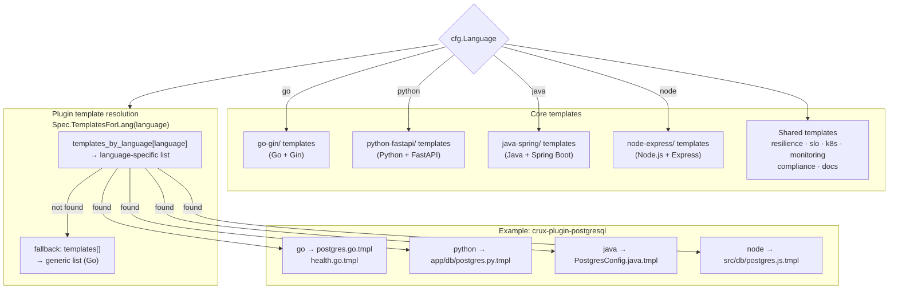

---

## 9. TUI State Machine

> States the Bubbletea TUI moves through during `crux new`.

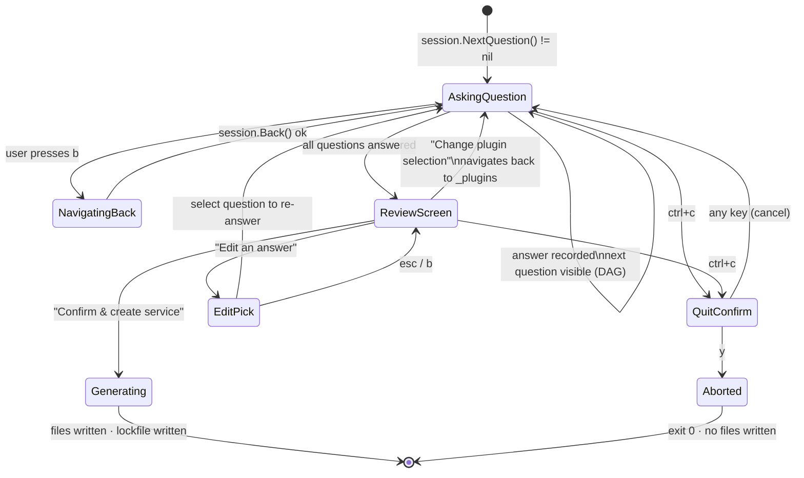

---

## 10. Generated Service — Tier 1 Standards Applied

> What every generated service gets regardless of language or plugin selection.

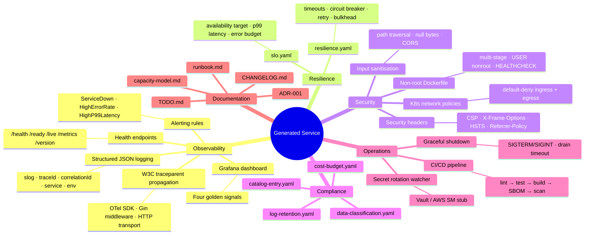

---

## 11. Delivery Phases — Timeline

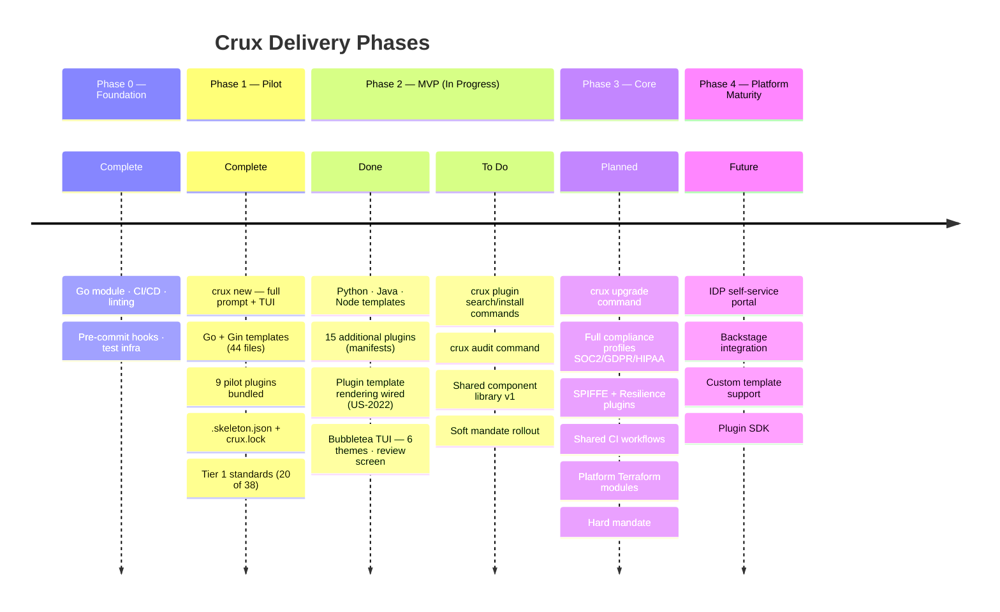

---

## 12. `crux new` — Combination Validation Rules

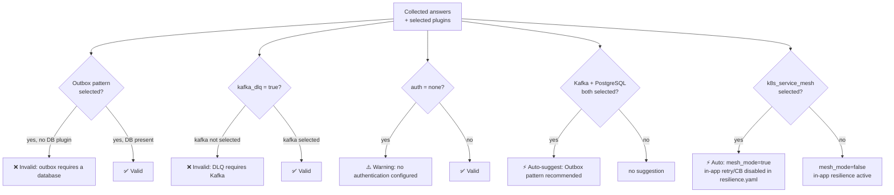

---

## 13. Plugin Manifest Schema

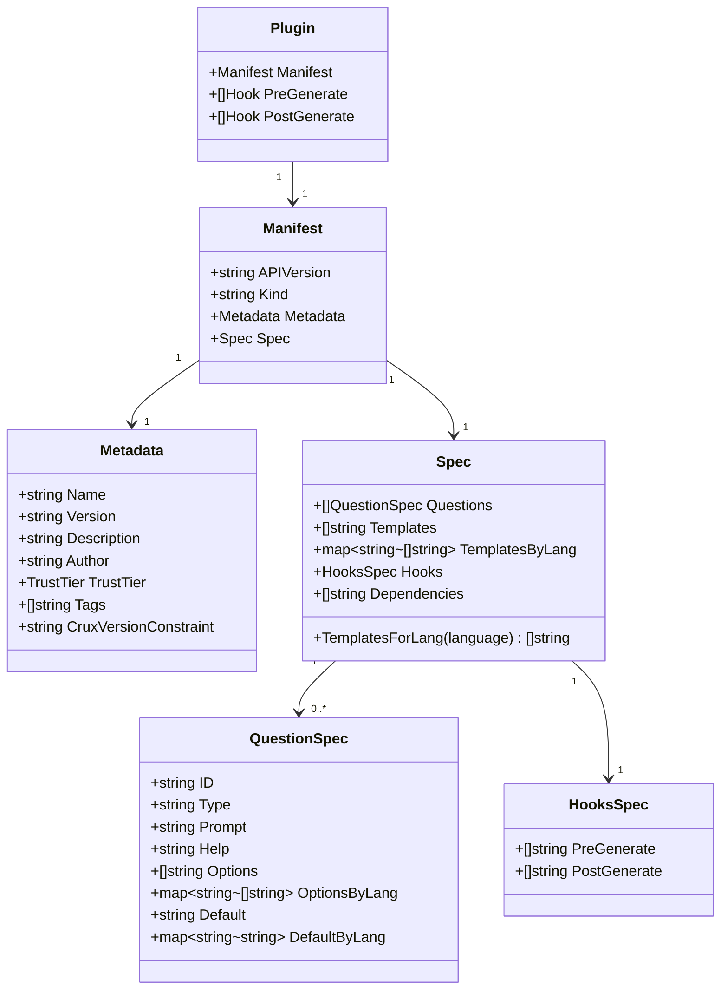

---

## 14. Generated Service — Package Dependency Graph (Go)

> Dependency flow inside a generated Go + Gin service.

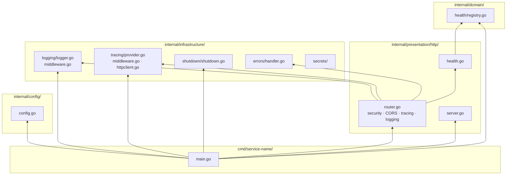

---

## 15. Lockfile Schema

> What `.skeleton.json` records after generation.

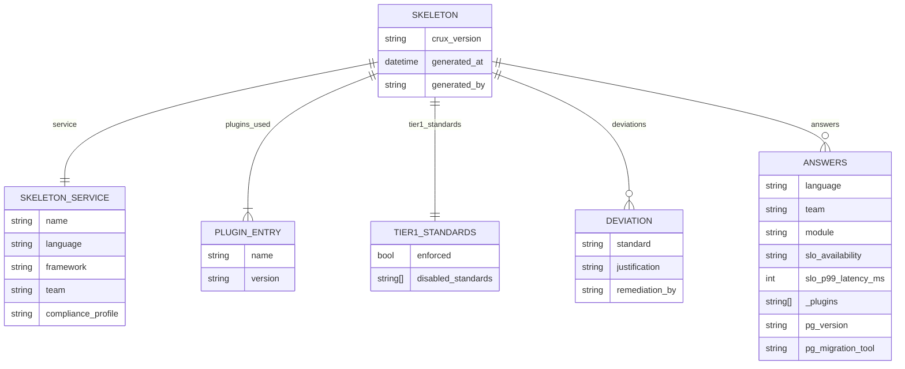
